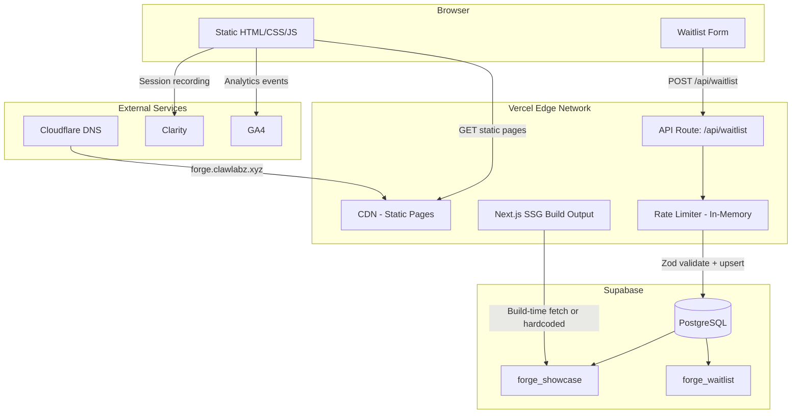

# P2 Architecture: Forge Website

> Version: 2.0 (post self-review)
> Date: 2026-03-17
> Status: Pending Approval
> Based on: P1-prd.md, P0-brainstorm-report.md, forge.config.yaml

---

## 1. Technology Stack

| Layer | Choice | Rationale |
|-------|--------|-----------|
| Framework | Next.js 15 (App Router) | SSG-first, matches ClawLabz ecosystem, excellent DX |
| Language | TypeScript 5.x | Full-stack type safety, Zod integration |
| Styling | Tailwind CSS 4 + shadcn/ui | Utility-first, zero-runtime, consistent with ClawLabz stack |
| Database | Supabase PostgreSQL | Shared Supabase project (`forge_` prefix), free tier, RLS |
| Validation | Zod | Runtime schema validation for API input |
| Deployment | Vercel | Zero-config Next.js hosting, free hobby tier |
| DNS | Cloudflare | `forge.clawlabz.xyz`, free tier, DDoS protection |
| Analytics | GA4 + Microsoft Clarity | Free, complementary (quantitative + heatmaps) |
| Fonts | next/font/google (Inter) | Zero CLS, self-hosted subset |
| Images | next/image | Automatic WebP/AVIF, lazy loading, responsive srcset |

### Dependencies (Minimal)

| Package | Purpose | Bundle Impact |
|---------|---------|---------------|
| `next` | Framework | N/A (server) |
| `react`, `react-dom` | UI runtime | ~40KB gzipped |
| `tailwindcss` | Styling | 0KB runtime (build-time) |
| `zod` | Validation | ~13KB gzipped |
| `@supabase/supabase-js` | DB client (server-only) | 0KB client bundle |
| `lucide-react` | Icons (tree-shakeable) | ~1KB per icon used |

No heavy animation libraries. CSS transitions and `@keyframes` for pipeline visualization. No Framer Motion for MVP.

---

## 2. System Architecture



### Architecture Decisions

| Decision | Choice | Alternatives Considered | Rationale |
|----------|--------|------------------------|-----------|
| Rendering strategy | SSG for all pages | SSR, ISR | All content is static or build-time; no per-request data needed |
| Showcase data source | Hardcoded JSON in codebase | Runtime Supabase fetch, ISR | Showcase changes rarely; redeploy on update is acceptable; eliminates runtime DB dependency for display |
| Rate limiting | In-memory Map per serverless instance | Upstash Redis, Vercel KV | MVP volume is low; in-memory is sufficient and free; upgrade to Redis if abuse detected |
| Waitlist API | Single POST endpoint | Supabase direct insert via client SDK | Server-side validation + rate limiting requires a server route; keeps Supabase credentials off client |
| Component library | shadcn/ui (copy-paste, not dependency) | Radix Primitives, Headless UI | Full control, no version lock, consistent with ClawLabz projects |
| Animation | CSS-only | Framer Motion, GSAP | Minimal bundle, sufficient for pipeline viz and hover effects |

---

## 3. Project Structure

```
forge-website/
├── src/
│   ├── app/                          # Next.js App Router
│   │   ├── layout.tsx                # Root layout (fonts, metadata, analytics)
│   │   ├── page.tsx                  # Landing page (/)
│   │   ├── not-found.tsx             # Custom 404
│   │   ├── showcase/
│   │   │   └── page.tsx              # Showcase page (/showcase)
│   │   ├── pricing/
│   │   │   └── page.tsx              # Pricing page (/pricing)
│   │   ├── docs/
│   │   │   └── page.tsx              # Docs page (/docs)
│   │   ├── about/
│   │   │   └── page.tsx              # About page (/about)
│   │   └── api/
│   │       └── waitlist/
│   │           └── route.ts          # POST /api/waitlist
│   ├── components/
│   │   ├── ui/                       # shadcn/ui primitives
│   │   │   ├── button.tsx
│   │   │   ├── input.tsx
│   │   │   ├── card.tsx
│   │   │   ├── badge.tsx
│   │   │   └── ...
│   │   ├── layout/                   # Shared layout components
│   │   │   ├── header.tsx            # Top nav with mobile hamburger
│   │   │   ├── footer.tsx            # Site footer
│   │   │   ├── nav.tsx               # Navigation links
│   │   │   └── mobile-menu.tsx       # Mobile slide-out menu
│   │   ├── sections/                 # Page section components
│   │   │   ├── hero.tsx              # Landing hero
│   │   │   ├── how-it-works.tsx      # CLI explanation
│   │   │   ├── pipeline.tsx          # P0-P7 pipeline visualization
│   │   │   ├── terminal-demo.tsx     # Asciinema embed
│   │   │   ├── showcase-preview.tsx  # Landing page showcase cards
│   │   │   ├── competitor-table.tsx  # Forge vs competitors
│   │   │   ├── cta-section.tsx       # Call-to-action block
│   │   │   ├── pricing-cards.tsx     # Pricing tier cards
│   │   │   ├── pricing-faq.tsx       # Pricing FAQ accordion
│   │   │   ├── feature-comparison.tsx# Feature comparison table
│   │   │   └── github-stats.tsx      # GitHub stars/commits display
│   │   └── forms/
│   │       └── waitlist-form.tsx     # Email + plan interest form
│   └── lib/
│       ├── supabase.ts               # Supabase server client (service role)
│       ├── validations.ts            # Zod schemas (waitlist input)
│       ├── constants.ts              # Site metadata, nav links, pricing data
│       ├── rate-limit.ts             # In-memory sliding window rate limiter
│       └── showcase-data.ts          # Hardcoded showcase products JSON
├── public/
│   ├── og/                           # OG images per page
│   │   ├── home.png
│   │   ├── showcase.png
│   │   ├── pricing.png
│   │   ├── docs.png
│   │   └── about.png
│   ├── screenshots/                  # Showcase product screenshots
│   ├── favicon.ico
│   └── robots.txt
├── docs/
│   └── forge/                        # Forge pipeline documents
│       ├── P0-brainstorm-report.md
│       ├── P1-prd.md
│       ├── P2-architecture.md        # This document
│       └── P2-dev-plan.md
├── forge.config.yaml                 # Forge plugin config
├── next.config.ts                    # Next.js config (CSP, redirects)
├── tailwind.config.ts                # Tailwind config (theme, fonts)
├── tsconfig.json
├── package.json
├── .env.local                        # SUPABASE_URL, SUPABASE_SERVICE_ROLE_KEY
├── .env.example                      # Template for required env vars
└── .gitignore
```

### File Responsibilities

| File | Responsibility | Approximate Lines |
|------|---------------|-------------------|
| `src/app/page.tsx` | Compose landing sections (Hero, HowItWorks, Pipeline, Demo, Showcase, Competitors, CTA) | 80-120 |
| `src/app/api/waitlist/route.ts` | Validate input, rate limit, upsert to Supabase, return JSON | 60-80 |
| `src/components/sections/pipeline.tsx` | 8-stage pipeline visualization with CSS animations | 150-200 |
| `src/components/forms/waitlist-form.tsx` | Client component: email input, plan selector, submit handler, inline feedback | 100-150 |
| `src/lib/rate-limit.ts` | Sliding window counter per IP, 20 req/min | 40-60 |
| `src/lib/showcase-data.ts` | Typed array of showcase products (name, url, screenshot, stats) | 50-80 |

---

## 4. Database Schema

### Table: `forge_waitlist`

```sql
CREATE TABLE forge_waitlist (
  id             uuid PRIMARY KEY DEFAULT gen_random_uuid(),
  email          varchar(254) NOT NULL UNIQUE,
  plan_interest  text CHECK (plan_interest IN ('free', 'pro', 'unlimited', 'hosted')),
  source_page    varchar(100),
  created_at     timestamptz NOT NULL DEFAULT now()
);

CREATE INDEX idx_forge_waitlist_plan ON forge_waitlist (plan_interest);
CREATE INDEX idx_forge_waitlist_created ON forge_waitlist (created_at DESC);
```

### Table: `forge_showcase`

```sql
CREATE TABLE forge_showcase (
  id                  uuid PRIMARY KEY DEFAULT gen_random_uuid(),
  name                varchar(100) NOT NULL,
  description         text,
  url                 varchar(500),
  screenshot_url      varchar(500),
  build_time_minutes  int,
  feature_count       int,
  tech_stack          text[],
  build_log_url       varchar(500),
  published           boolean NOT NULL DEFAULT true,
  sort_order          int NOT NULL DEFAULT 0,
  created_at          timestamptz NOT NULL DEFAULT now()
);

CREATE INDEX idx_forge_showcase_published ON forge_showcase (published, sort_order);
```

### Row-Level Security

```sql
-- forge_waitlist: anonymous users can INSERT only
ALTER TABLE forge_waitlist ENABLE ROW LEVEL SECURITY;

CREATE POLICY "anon_insert_waitlist"
  ON forge_waitlist FOR INSERT
  TO anon
  WITH CHECK (true);

-- No SELECT/UPDATE/DELETE for anon — admin access via service role key only

-- forge_showcase: anonymous users can SELECT published items only
ALTER TABLE forge_showcase ENABLE ROW LEVEL SECURITY;

CREATE POLICY "anon_select_published_showcase"
  ON forge_showcase FOR SELECT
  TO anon
  USING (published = true);

-- INSERT/UPDATE/DELETE via service role key only (seed scripts, admin)
```

### Seed Data

Showcase table seeded with 3 real Forge-built products:

1. **ClawHealth** -- AI health companion, 45 min build, 12 features, Next.js + Supabase
2. **ClawToolkit** -- AI agent tool marketplace, 60 min build, 18 features, Next.js + Supabase
3. **Forge Website** -- This website (meta-dogfooding), build time TBD

Seed script: `supabase/seed.sql` or managed via Supabase dashboard.

---

## 5. API Design

### POST `/api/waitlist`

**Single endpoint.** No authentication required.

#### Request

```
POST /api/waitlist
Content-Type: application/json

{
  "email": "user@example.com",
  "plan_interest": "pro",        // "free" | "pro" | "unlimited" | "hosted" | null
  "source_page": "/pricing"      // page where the form was submitted
}
```

#### Zod Schema

```typescript
import { z } from 'zod';

export const waitlistSchema = z.object({
  email: z
    .string()
    .email('Invalid email format')
    .max(254, 'Email too long')
    .transform((v) => v.toLowerCase().trim()),
  plan_interest: z
    .enum(['free', 'pro', 'unlimited', 'hosted'])
    .nullable()
    .optional(),
  source_page: z
    .string()
    .max(100)
    .optional()
    .default('/'),
});
```

#### Response: Success (200)

```json
{
  "success": true,
  "message": "You're on the list!"
}
```

#### Response: Duplicate Email (200)

```json
{
  "success": true,
  "message": "You're already on the waitlist!"
}
```

Supabase upsert with `ON CONFLICT (email) DO NOTHING`. Both cases return 200 to avoid leaking email existence.

#### Response: Validation Error (400)

```json
{
  "success": false,
  "message": "Invalid email format"
}
```

#### Response: Rate Limit (429)

```json
{
  "success": false,
  "message": "Too many requests, please try again in 60 seconds"
}
```

#### Response: Server Error (500)

```json
{
  "success": false,
  "message": "Something went wrong. Please try again later."
}
```

No stack traces, no internal details exposed.

#### Rate Limiting Implementation

```typescript
// In-memory sliding window: Map<ip, timestamp[]>
// 20 requests per 60-second window per IP
// Cleanup stale entries on each request
// Note: Vercel serverless instances are ephemeral —
// rate limit resets per instance. Acceptable for MVP volume.
// Upgrade to Upstash Redis if abuse is detected.
```

#### Route Handler Flow

```
Request
  → Extract IP from x-forwarded-for header
  → Check rate limit (429 if exceeded)
  → Parse body with Zod (400 if invalid)
  → Supabase upsert (ON CONFLICT DO NOTHING)
  → Return 200 with appropriate message
  → Catch: Return 500 with generic message
```

---

## 6. Performance Strategy

### Rendering Strategy

| Page | Strategy | Rationale |
|------|----------|-----------|
| `/` (Landing) | SSG | Fully static content |
| `/showcase` | SSG | Hardcoded showcase data, no runtime DB |
| `/pricing` | SSG | Static pricing tiers |
| `/docs` | SSG | Static documentation |
| `/about` | SSG | Static content |
| `/api/waitlist` | Serverless function | Only dynamic endpoint |

**All 5 pages are statically generated at build time.** Zero runtime database queries for page rendering.

### Bundle Optimization

- **Code splitting**: Automatic per-route via Next.js App Router
- **Dynamic imports**: `waitlist-form.tsx` loaded as client component only where used
- **Tree shaking**: lucide-react icons individually imported
- **No heavy deps**: No Framer Motion, no syntax highlighting library (code blocks are static HTML)
- **Target**: Total JS bundle < 100KB gzipped for landing page

### Image Optimization

- All images served via `next/image` (automatic WebP/AVIF, responsive srcset)
- Showcase screenshots: max 800px width, lazy loaded
- OG images: pre-generated 1200x630 PNG per page
- No external image domains needed (all self-hosted in `/public/`)

### Font Optimization

```typescript
// src/app/layout.tsx
import { Inter } from 'next/font/google';

const inter = Inter({
  subsets: ['latin'],
  display: 'swap',     // Zero CLS
  variable: '--font-inter',
});
```

### Core Web Vitals Targets

| Metric | Target | Strategy |
|--------|--------|----------|
| FCP | < 1.5s | SSG, font preload, minimal critical CSS |
| LCP | < 2.5s | Hero image preloaded, no layout shifts |
| CLS | < 0.1 | Font display swap, explicit image dimensions |
| TTI | < 3s on 3G | Minimal JS, code splitting |
| Lighthouse | >= 90 | All of the above combined |

### Caching

- Static pages: served from Vercel CDN with immutable cache headers
- API route: no caching (each waitlist POST is unique)
- Static assets (`/public/*`): `Cache-Control: public, max-age=31536000, immutable`

---

## 7. Security Strategy

### Input Validation

- All waitlist input validated server-side with Zod before touching the database
- Email: RFC-compliant format check, max 254 characters, lowercased and trimmed
- `plan_interest`: strict enum check (no arbitrary strings)
- `source_page`: max 100 characters, string type only

### Rate Limiting

- 20 requests per 60-second sliding window per IP
- IP extracted from `x-forwarded-for` header (Vercel populates this)
- HTTP 429 response with human-readable message (no retry-after countdown to avoid timing attacks)
- In-memory implementation is ephemeral per serverless instance; this is acceptable for MVP

### Environment Variables

```bash
# .env.local (never committed)
SUPABASE_URL=https://xxx.supabase.co
SUPABASE_SERVICE_ROLE_KEY=eyJ...

# Optional
NEXT_PUBLIC_GA4_ID=G-XXXXXXXXXX
NEXT_PUBLIC_CLARITY_ID=xxxxxxxxxx
```

- Supabase service role key is server-only (never in `NEXT_PUBLIC_*`)
- `.env.example` committed with empty values as documentation
- `.env.local` in `.gitignore`

### Content Security Policy

```typescript
// next.config.ts
const securityHeaders = [
  {
    key: 'Content-Security-Policy',
    value: [
      "default-src 'self'",
      "script-src 'self' 'unsafe-inline' https://www.googletagmanager.com https://www.clarity.ms",
      "style-src 'self' 'unsafe-inline'",
      "img-src 'self' data: https:",
      "font-src 'self'",
      "connect-src 'self' https://*.supabase.co https://www.google-analytics.com https://www.clarity.ms",
      "frame-src 'self' https://asciinema.org",  // for terminal demo embed
    ].join('; '),
  },
  { key: 'X-Frame-Options', value: 'DENY' },
  { key: 'X-Content-Type-Options', value: 'nosniff' },
  { key: 'Referrer-Policy', value: 'strict-origin-when-cross-origin' },
  { key: 'Permissions-Policy', value: 'camera=(), microphone=(), geolocation=()' },
];
```

### CORS

No custom CORS configuration needed. The API route is same-origin (form submits from the same domain). Vercel does not add permissive CORS headers by default.

### Data Protection

- No PII beyond email addresses in the waitlist
- No passwords (no auth in MVP)
- Supabase RLS prevents unauthorized reads of waitlist data
- Service role key used only in server-side API route
- Error responses never expose database errors, query details, or stack traces

### Dependency Security

- Minimal dependencies (6 production packages)
- `npm audit` run before each deploy
- Dependabot enabled on GitHub repository for automated CVE alerts

---

## 8. SEO Strategy

### Per-Page Metadata

| Page | Title | Description |
|------|-------|-------------|
| `/` | Forge -- Build Products from a Single Sentence | AI-powered product factory. Describe your idea, get a deployed product. Research, PRD, architecture, code, tests, deploy -- fully automated. |
| `/showcase` | Showcase -- Products Built with Forge | Real products built by Forge in under 60 minutes. See screenshots, live links, and build logs. |
| `/pricing` | Pricing -- Forge | Free open-source plugin, Pro one-time purchase, or Unlimited subscription. Compare plans and features. |
| `/docs` | Documentation -- Forge | Install Forge, build your first product, and troubleshoot common issues. |
| `/about` | About Forge -- The One-Person Product Factory | The story behind Forge, the creator, and the vision for AI-powered product development. |

### Structured Data

- `Organization` schema on all pages
- `SoftwareApplication` schema on landing page
- `FAQPage` schema on pricing page
- `BreadcrumbList` on all sub-pages

### Technical SEO

- `robots.txt` allowing all crawlers
- Sitemap generated by Next.js (`next-sitemap` or manual)
- Canonical URLs on all pages
- OG images (1200x630) per page in `/public/og/`
- `<meta name="twitter:card" content="summary_large_image" />`

---

## 9. Self-Review Log

### Security Engineer Review

| # | Severity | Finding | Remediation | Status |
|---|----------|---------|-------------|--------|
| S1 | HIGH | Rate limiter is per-instance in serverless; a determined attacker can bypass by hitting different instances | Documented as known limitation. Mitigation: monitor Supabase insert volume; upgrade to Upstash Redis if abuse detected. Vercel also provides built-in DDoS protection at the edge. | ACCEPTED |
| S2 | MEDIUM | `x-forwarded-for` can be spoofed if not behind trusted proxy | Vercel always sets this header correctly and strips client-provided values. Documented that this relies on Vercel infrastructure. | RESOLVED |
| S3 | MEDIUM | Waitlist upsert returns same 200 for new and duplicate emails -- potential enumeration concern | Both responses return identical 200 with different messages. Messages are generic enough ("You're on the list" vs "Already on the waitlist") that enumeration is low risk for a waitlist. | ACCEPTED |
| S4 | LOW | No CSRF protection on POST /api/waitlist | Endpoint is idempotent (upsert) and public. No session or auth involved. CSRF is not applicable. | RESOLVED |
| S5 | LOW | Asciinema iframe embed could be a vector | CSP `frame-src` restricted to `https://asciinema.org` only. | RESOLVED |

### Performance Engineer Review

| # | Severity | Finding | Remediation | Status |
|---|----------|---------|-------------|--------|
| P1 | HIGH | Initial design considered runtime Supabase fetch for showcase page | Changed to hardcoded JSON. Zero runtime DB queries for all display pages. Showcase updates require redeploy (acceptable for 3-5 products). | RESOLVED |
| P2 | MEDIUM | Framer Motion was in initial dependency list (~30KB gzipped) | Removed. Using CSS transitions and `@keyframes` for pipeline animation. Zero JS animation overhead. | RESOLVED |
| P3 | MEDIUM | Terminal demo embed (asciinema) could block page load | Loaded in an iframe with `loading="lazy"`. Fallback to static screenshot if embed fails. | RESOLVED |
| P4 | LOW | GA4 and Clarity scripts add ~30KB total | Loaded with `next/script strategy="afterInteractive"`. Does not affect FCP/LCP. | RESOLVED |
| P5 | LOW | OG images not optimized | Pre-generate as compressed PNG (< 200KB each). Consider generating via `@vercel/og` for dynamic text. | NOTED |

### Changes Made During Review

1. **Showcase data source changed** from runtime Supabase fetch to hardcoded JSON (P1)
2. **Framer Motion removed** from dependency list (P2)
3. **CSP headers added** with specific frame-src for asciinema (S5)
4. **Rate limit documentation** clarified regarding serverless per-instance behavior (S1)
5. **Email enumeration risk** documented and accepted as low severity for a waitlist (S3)
