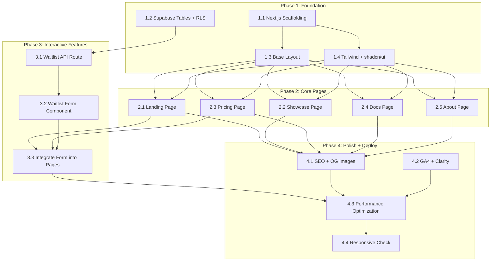

# P2 Development Plan: Forge Website

> Version: 1.0
> Date: 2026-03-17
> Based on: P2-architecture.md, P1-prd.md
> Estimated Total Effort: 4-6 hours (solo developer)

---

## Phase Overview

| Phase | Name | Tasks | Parallelizable | Est. Time |
|-------|------|-------|----------------|-----------|
| 1 | Foundation | 4 tasks | Yes (1.1+1.2 parallel, 1.3+1.4 parallel) | 1-1.5h |
| 2 | Core Pages | 5 tasks | Yes (all 5 pages parallel) | 1.5-2h |
| 3 | Interactive Features | 3 tasks | Partial (3.1 then 3.2 then 3.3) | 0.5-1h |
| 4 | Polish and Deploy | 4 tasks | Yes (4.1+4.2 parallel, then 4.3+4.4) | 1-1.5h |

---

## Dependency Graph



---

## Phase 1: Foundation

### 1.1 Next.js Project Scaffolding

**Objective**: Initialize the project with all core dependencies.

**Tasks**:
- Run `npx create-next-app@latest` with App Router, TypeScript, Tailwind CSS, ESLint
- Install production dependencies: `zod`, `@supabase/supabase-js`, `lucide-react`
- Create `.env.example` with `SUPABASE_URL`, `SUPABASE_SERVICE_ROLE_KEY`, `NEXT_PUBLIC_GA4_ID`, `NEXT_PUBLIC_CLARITY_ID`
- Create `.env.local` from example (gitignored)
- Configure `next.config.ts` with security headers (CSP, X-Frame-Options, X-Content-Type-Options, Referrer-Policy, Permissions-Policy)
- Configure `tsconfig.json` path aliases (`@/` pointing to `src/`)
- Add `.gitignore` entries for `.env.local`, `.next/`, `node_modules/`

**Acceptance**: `pnpm dev` starts without errors, `pnpm build` succeeds.

### 1.2 Supabase Tables + RLS + Seed Data

**Objective**: Create database schema and populate initial showcase data.

**Can run in parallel with 1.1.**

**Tasks**:
- Create migration SQL: `forge_waitlist` table with email UNIQUE constraint, plan_interest CHECK, indexes
- Create migration SQL: `forge_showcase` table with published flag, sort_order, indexes
- Enable RLS on both tables
- Create RLS policies: anon INSERT on waitlist, anon SELECT on showcase WHERE published=true
- Write seed SQL: 3 showcase products (ClawHealth, ClawToolkit, Forge Website)
- Execute migrations via Supabase dashboard or `supabase-migrate.sh` script

**Acceptance**: Tables exist, RLS policies active, seed data queryable via Supabase dashboard.

### 1.3 Base Layout (Header / Footer / Nav)

**Depends on**: 1.1

**Tasks**:
- Create `src/app/layout.tsx`: root layout with Inter font, `<html lang="en">`, metadata defaults
- Create `src/components/layout/header.tsx`: logo + nav links (Home, Showcase, Pricing, Docs, About) + "Get Started" CTA button
- Create `src/components/layout/footer.tsx`: copyright, GitHub link, Twitter/X link, email
- Create `src/components/layout/nav.tsx`: desktop navigation links
- Create `src/components/layout/mobile-menu.tsx`: hamburger icon, slide-out menu for mobile (< 768px)
- Create `src/lib/constants.ts`: nav links array, site metadata, external URLs

**Acceptance**: Header and footer render on all pages, mobile menu opens/closes, responsive at 375px and 1440px.

### 1.4 Tailwind Config + shadcn/ui Setup

**Depends on**: 1.1 (can run in parallel with 1.3)

**Tasks**:
- Configure Tailwind theme: custom colors (brand palette), font family (Inter), breakpoints (375, 768, 1024, 1440)
- Run `npx shadcn@latest init` to set up shadcn/ui
- Add initial shadcn components: `button`, `input`, `card`, `badge`, `accordion`
- Verify component rendering with a test page

**Acceptance**: shadcn components render correctly with custom theme, dark mode not required for MVP.

### Phase 1 Checkpoint

```
[ ] pnpm build succeeds with zero errors
[ ] pnpm lint passes
[ ] Base layout (header + footer + nav) renders at / route
[ ] Mobile hamburger menu works at 375px
[ ] Supabase tables created with RLS active
```

---

## Phase 2: Core Pages

**All 5 pages can be developed in parallel** after Phase 1 completes. Each page is an independent file under `src/app/`.

### 2.1 Landing Page (`/`)

**Depends on**: 1.3, 1.4

**Tasks**:
- Create `src/app/page.tsx` composing the following sections:
- `src/components/sections/hero.tsx`: Headline "Build Products from a Single Sentence", subtitle explaining Forge is a Claude Code plugin, two CTAs ("Install Free" linking to /docs, "View Pricing" linking to /pricing), "Non-developer? Hosted version coming soon" note
- `src/components/sections/how-it-works.tsx`: Explain that Forge is a CLI tool, what it requires (Node.js, Claude Code, API key), what it produces (a deployed product)
- `src/components/sections/pipeline.tsx`: 8-stage pipeline visualization (P0 Idea Input through P7 Deployment), CSS-animated step-by-step flow, each stage with icon + name + one-line description
- `src/components/sections/terminal-demo.tsx`: Asciinema iframe embed with `loading="lazy"`, play/pause controls, fallback to static screenshot + "Watch on YouTube" link if embed fails
- `src/components/sections/showcase-preview.tsx`: 3 product cards from `showcase-data.ts`, each with screenshot, name, build time, feature count, link to live product
- `src/components/sections/competitor-table.tsx`: Forge vs Bolt.new vs Lovable vs Cursor comparison table (features: full pipeline, open source, CLI-based, code ownership, pricing)
- `src/components/sections/cta-section.tsx`: Bottom CTA with "Install Free" and "View Pricing" buttons

**Acceptance**: All 7 sections render, pipeline animation works, terminal demo loads with fallback, responsive at all breakpoints.

### 2.2 Showcase Page (`/showcase`)

**Depends on**: 1.3, 1.4

**Tasks**:
- Create `src/lib/showcase-data.ts`: typed array of showcase products with all fields (name, description, url, screenshot_url, build_time_minutes, feature_count, tech_stack, build_log_url)
- Create `src/app/showcase/page.tsx`: page title + description + product cards grid
- Product card: screenshot image (next/image), product name, description, build time badge, feature count badge, tech stack tags, "View Live" button (opens new tab), "Build Log" link (if available)
- Grid layout: 1 column on mobile, 2 columns on tablet, 3 columns on desktop
- Empty state: "More products coming soon" if list has fewer than 3 items

**Acceptance**: 3 product cards render in grid, all links open in new tabs, responsive layout.

### 2.3 Pricing Page (`/pricing`)

**Depends on**: 1.3, 1.4

**Tasks**:
- Create `src/app/pricing/page.tsx` composing:
- `src/components/sections/pricing-cards.tsx`: 3 pricing tiers:
  - **Free** ($0): Open-source CLI plugin, bring your own API key, full P0-P7 pipeline, community support. CTA: "Install Now" (link to /docs)
  - **Pro** ($29/project): One-time purchase, zero-config (auto Vercel/Supabase/Cloudflare), priority bug fixes, template library. CTA: "Join Waitlist" (opens waitlist form with plan_interest=pro)
  - **Unlimited** ($99/month): Subscription, unlimited projects, all Pro features, priority support, early access. CTA: "Join Waitlist" (opens waitlist form with plan_interest=unlimited)
- `src/components/sections/feature-comparison.tsx`: Feature comparison table (rows: pipeline stages, deployment, support, templates, updates; columns: Free/Pro/Unlimited with checkmarks)
- Reuse `competitor-table.tsx` from landing page
- `src/components/sections/pricing-faq.tsx`: Accordion FAQ with at least 5 questions (What is a project?, Is Pro one-time or subscription?, Difference between open-source and paid?, Can I cancel Unlimited?, When will paid plans be available?)

**Acceptance**: 3 pricing cards render, FAQ accordion opens/closes, feature comparison table is clear, responsive.

### 2.4 Docs Page (`/docs`)

**Depends on**: 1.3, 1.4

**Tasks**:
- Create `src/app/docs/page.tsx` with structured documentation:
- **Prerequisites**: Node.js >= 22, Claude Code installed, Anthropic API key
- **Installation**: `claude plugin add clawlabz/forge` with copy button
- **Verify Installation**: `claude /forge-status` command
- **Quick Start**: Step-by-step first project tutorial (create directory, run `/forge "description"`, wait for pipeline, check output)
- **Supported Tech Stacks**: Next.js, React, Node.js, etc. (table format)
- **Configuration**: `forge.config.yaml` fields explanation
- **Troubleshooting**: Common errors and solutions (5+ items)
- **FAQ**: Additional questions
- Non-technical user banner at top: "Looking for a no-code option? Join the waitlist for our hosted version."
- Code blocks with copy-to-clipboard button (simple `navigator.clipboard` implementation)

**Acceptance**: All documentation sections render with proper heading hierarchy, code blocks are copyable, responsive.

### 2.5 About Page (`/about`)

**Depends on**: 1.3, 1.4

**Tasks**:
- Create `src/app/about/page.tsx` with:
- **About Forge**: Project story -- why it was created, the problem it solves, the "one-person product factory" vision
- **Creator**: Introduction (presented as "Creator" not "Team"), brief bio, photo/avatar
- **Vision**: Where Forge is heading (hosted version, community showcase, enterprise)
- `src/components/sections/github-stats.tsx`: Display GitHub stats (stars, last commit, contributors). For MVP: hardcoded values updated at build time, or fetched at build time via GitHub API in `getStaticProps` equivalent
- **Contact**: GitHub repo link, Twitter/X, email address
- Links to all social/contact channels with proper icons (lucide-react)

**Acceptance**: All sections render, contact links work, GitHub stats display (hardcoded is acceptable for MVP).

### Phase 2 Checkpoint

```
[ ] pnpm build succeeds
[ ] pnpm lint passes
[ ] Landing page: all 7 sections render
[ ] Showcase page: 3 product cards in grid
[ ] Pricing page: 3 tiers + comparison + FAQ
[ ] Docs page: all sections with copyable code blocks
[ ] About page: story + creator + GitHub stats + contact
[ ] All pages responsive at 375px, 768px, 1024px, 1440px
```

---

## Phase 3: Interactive Features

### 3.1 Waitlist API Route

**Depends on**: 1.2 (Supabase tables)

**Tasks**:
- Create `src/lib/validations.ts`: Zod schema for waitlist input (email, plan_interest, source_page)
- Create `src/lib/rate-limit.ts`: In-memory sliding window rate limiter (20 req/min per IP, using `Map<string, number[]>`, cleanup stale entries older than 60s on each call)
- Create `src/lib/supabase.ts`: Server-side Supabase client using `SUPABASE_URL` and `SUPABASE_SERVICE_ROLE_KEY` from environment
- Create `src/app/api/waitlist/route.ts`:
  - Extract IP from `x-forwarded-for` or `x-real-ip` header
  - Check rate limit, return 429 if exceeded
  - Parse and validate body with Zod, return 400 if invalid
  - Upsert to `forge_waitlist` with `ON CONFLICT (email) DO NOTHING`
  - Return 200 with success message
  - Catch all errors, return 500 with generic message (no stack trace)

**Acceptance**: POST with valid email returns 200, duplicate email returns 200 with "already on waitlist", invalid email returns 400, 21st request in 60s returns 429.

### 3.2 Waitlist Form Component

**Depends on**: 3.1

**Tasks**:
- Create `src/components/forms/waitlist-form.tsx` (client component with `"use client"`):
  - Email input field (shadcn Input)
  - Plan interest selector (radio group or select: Free / Pro / Unlimited / Hosted)
  - Submit button with loading state (spinner)
  - Client-side validation (email format check before submit)
  - Fetch POST to `/api/waitlist` on submit
  - Inline success state: green checkmark + "You're on the list!" message (replaces form)
  - Inline error state: red text below form with error message
  - Duplicate state: "You're already on the waitlist!" (friendly, not error-styled)
  - Network error handling: "Something went wrong. Please try again."
  - `source_page` auto-detected from `window.location.pathname`
  - Optional prop `defaultPlanInterest` for pre-selecting plan from pricing page

**Acceptance**: Form submits successfully, shows inline success, handles all error states, no page reload.

### 3.3 Integrate Waitlist Form into Pages

**Depends on**: 3.2, 2.1 (Landing), 2.3 (Pricing)

**Tasks**:
- Landing page (`/`): Add waitlist form in CTA section at bottom, no pre-selected plan
- Pricing page (`/pricing`): Pro card CTA opens/scrolls to waitlist form with `defaultPlanInterest="pro"`, Unlimited card CTA with `defaultPlanInterest="unlimited"`
- Docs page (`/docs`): Add waitlist form in "hosted version" banner for non-technical users with `defaultPlanInterest="hosted"`

**Acceptance**: Waitlist form appears on Landing, Pricing, and Docs pages, plan interest pre-selects correctly from Pricing CTAs, submissions reach Supabase.

### Phase 3 Checkpoint

```
[ ] pnpm build succeeds
[ ] pnpm lint passes
[ ] POST /api/waitlist returns correct responses for all cases
[ ] Waitlist form on Landing page submits successfully
[ ] Waitlist form on Pricing page pre-selects plan interest
[ ] Waitlist form on Docs page works for hosted interest
[ ] Duplicate email handled gracefully
[ ] Rate limit returns 429 after 20 requests
[ ] Submissions visible in Supabase forge_waitlist table
```

---

## Phase 4: Polish and Deploy

### 4.1 SEO (Meta Tags, OG Images, Structured Data)

**Depends on**: All Phase 2 pages

**Tasks**:
- Add unique `metadata` export to each page file (title, description, openGraph, twitter)
- Create or generate OG images (1200x630) for each page, place in `/public/og/`
- Add structured data (JSON-LD) to layout: `Organization` schema
- Add `SoftwareApplication` schema to landing page
- Add `FAQPage` schema to pricing page
- Add `BreadcrumbList` to sub-pages
- Create `/public/robots.txt` allowing all crawlers
- Add sitemap generation (either `next-sitemap` package or manual `sitemap.ts` in app directory)
- Verify canonical URLs on all pages

**Acceptance**: Each page has unique title/description, OG images render in social share preview, structured data validates in Google Rich Results Test.

### 4.2 GA4 + Clarity Integration

**Depends on**: Phase 2 pages exist (can run in parallel with 4.1)

**Tasks**:
- Add GA4 script via `next/script` with `strategy="afterInteractive"` in root layout
- Add Clarity script via `next/script` with `strategy="afterInteractive"` in root layout
- Conditionally load only when `NEXT_PUBLIC_GA4_ID` / `NEXT_PUBLIC_CLARITY_ID` env vars are set
- Add custom GA4 events:
  - `waitlist_submit` (on successful form submission, with plan_interest label)
  - `copy_install_command` (on docs page copy button click)
  - `demo_play` (on terminal demo play)
  - `showcase_click` (on showcase product link click)
  - `cta_click` (on any CTA button click, with label)

**Acceptance**: GA4 and Clarity load without blocking page render, custom events fire on interactions (verify in browser Network tab).

### 4.3 Performance Optimization

**Depends on**: 4.1, 4.2, 3.3

**Tasks**:
- Run Lighthouse on all 5 pages, document scores
- Optimize any images exceeding 200KB
- Verify no unused CSS/JS in bundle (`next build` analyzer)
- Check that waitlist form JS is only loaded on pages that use it
- Verify font loading does not cause CLS
- Test on simulated 3G connection (Chrome DevTools throttling)
- Fix any issues until Lighthouse Performance >= 90 on all pages

**Acceptance**: Lighthouse Performance >= 90, Accessibility >= 80, Best Practices >= 90 on all 5 pages.

### 4.4 Final Responsive Check

**Depends on**: 4.3

**Tasks**:
- Test all 5 pages at 4 breakpoints: 375px (iPhone SE), 768px (iPad), 1024px (laptop), 1440px (desktop)
- Verify no horizontal scrollbar at any breakpoint
- Verify touch targets >= 44x44px on mobile
- Verify hamburger menu works on mobile
- Verify pipeline visualization is readable on mobile (horizontal scroll or vertical stack)
- Verify pricing cards stack vertically on mobile
- Verify code blocks in docs have horizontal scroll (not overflow)
- Fix any layout issues found

**Acceptance**: All pages render correctly at all 4 breakpoints, no horizontal overflow, all interactive elements usable on touch devices.

### Phase 4 Checkpoint

```
[ ] pnpm build succeeds
[ ] pnpm lint passes
[ ] Lighthouse Performance >= 90 on all pages
[ ] Lighthouse Accessibility >= 80 on all pages
[ ] OG images render in Twitter/Slack link previews
[ ] GA4 events fire correctly
[ ] All 4 breakpoints verified (375, 768, 1024, 1440)
[ ] No horizontal scrollbar on any page at any breakpoint
```

---

## Deployment Checklist

After all 4 phases pass their checkpoints:

```
[ ] All env vars set in Vercel project settings (SUPABASE_URL, SUPABASE_SERVICE_ROLE_KEY)
[ ] NEXT_PUBLIC_GA4_ID and NEXT_PUBLIC_CLARITY_ID set (if available)
[ ] Vercel project created and linked to GitHub repo
[ ] Cloudflare DNS: forge.clawlabz.xyz CNAME to cname.vercel-dns.com
[ ] Production build succeeds on Vercel
[ ] Verify all pages load on forge.clawlabz.xyz
[ ] Verify HTTPS works (Vercel auto-SSL)
[ ] Verify waitlist POST works in production
[ ] Verify Supabase receives waitlist submissions
[ ] Submit sitemap to Google Search Console
```

---

## Risk Register

| # | Risk | Likelihood | Impact | Mitigation |
|---|------|-----------|--------|-----------|
| R1 | Asciinema embed breaks or loads slowly | Medium | Low | Fallback to static screenshot is already designed. Can replace with self-hosted video if needed. |
| R2 | Supabase free tier rate limits hit | Low | Medium | Waitlist is the only write operation; free tier allows 500 requests/sec. Monitor via Supabase dashboard. |
| R3 | In-memory rate limiter ineffective on Vercel (per-instance) | Medium | Low | Acceptable for MVP volume. Upgrade to Upstash Redis ($0 for 10K req/day) if abuse detected. |
| R4 | Showcase products go offline | Low | Medium | Showcase data is hardcoded; can update URLs or mark as "demo unavailable" via redeploy. |
| R5 | Lighthouse score below 90 due to analytics scripts | Medium | Low | Analytics loaded afterInteractive; should not affect core metrics. Can defer to post-launch if blocking. |
| R6 | OG images look wrong on specific social platforms | Medium | Low | Test with Twitter Card Validator and Facebook Sharing Debugger before launch. |
| R7 | Vercel build fails due to missing env vars | Low | High | `.env.example` documents all required vars. Vercel build will fail fast with clear error if Supabase vars missing (validate at build time in next.config.ts). |

---

## Post-Launch (Out of Scope for This Plan)

These items are documented for future reference but are NOT part of the current development plan:

- GitHub OAuth login (P1)
- Stripe payment integration (P1)
- User dashboard (P1)
- Confirmation email via Resend (P1)
- Changelog page from GitHub Releases (P1)
- Blog (P2)
- i18n multi-language support (P2)
- Community showcase submissions (P2)
- Hosted no-code version (P2)
