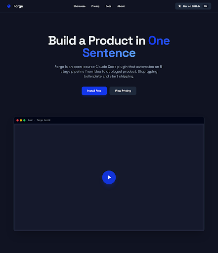
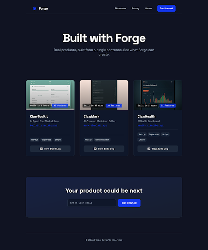
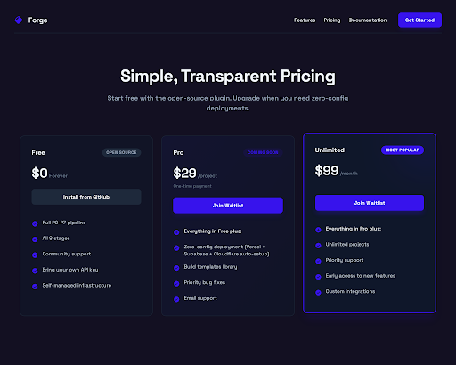
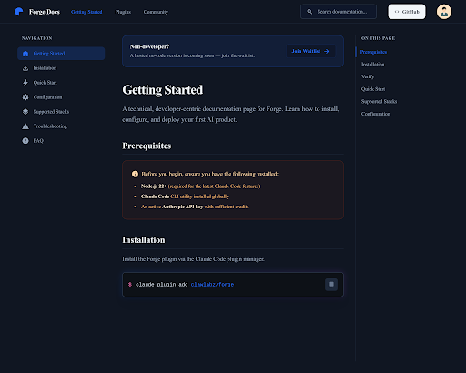
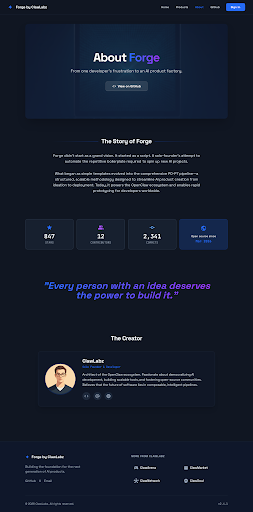

# Design Specification: Forge Website

> Version: 1.0
> Date: 2026-03-17
> Status: Pending Approval
> Generated by: Google Stitch + Forge
> Stitch Project ID: 2247946197529601075

## 1. Page Designs

### Homepage (Landing)

- **Screen ID**: d1fb86c804574d39af6460212a7cf0f3
- **Dimensions**: 2560 x 2970
- **Key sections**: Hero with "Build a Product in One Sentence", 8-stage pipeline visualization, terminal demo area, 3 showcase product cards, competitor comparison table, waitlist CTA
- **Notable**: Dark theme establishes brand identity, electric blue accent creates developer-focused aesthetic

### Showcase

- **Screen ID**: 9946ef8f27f74f5ba311ec0d0b0b2306
- **Dimensions**: 2560 x 3080
- **Key sections**: "Built with Forge" header, 3 product cards (ClawToolkit, ClawMark, ClawHealth) with screenshots/stats/tech tags/build log links, bottom waitlist CTA
- **Notable**: Cards show build time badges and feature counts for credibility

### Pricing

- **Screen ID**: 5dc393699f54406181616f11c176e2ad
- **Dimensions**: 2560 x 2048
- **Key sections**: 3 pricing cards (Free/Pro/Unlimited), feature comparison table, FAQ accordion, waitlist CTA
- **Notable**: Unlimited tier has highlighted/glowing border as "Most Popular"

### Docs

- **Screen ID**: 15aa7a0612294e9d9f69b98166a63946
- **Dimensions**: 2560 x 2050
- **Key sections**: Left sidebar nav, main content with prerequisites/install/quickstart/config, right "On this page" TOC, top banner for non-developers
- **Notable**: 3-column layout typical of developer docs, code blocks with copy buttons

### About

- **Screen ID**: 700e9135066b45feb0cbb41161a3e978
- **Dimensions**: 2560 x 5186
- **Key sections**: Hero, origin story narrative, creator profile card, vision quote with gradient text, GitHub stats (stars/contributors/commits), contact links, ClawLabz ecosystem links
- **Notable**: Longest page, narrative-driven storytelling approach

## 2. Design System (extracted from Stitch HTML)

### Colors
| Token | Value | Usage |
|-------|-------|-------|
| Primary | `#1337ec` | CTA buttons, links, active states, accent highlights |
| Background Dark | `#101322` | Page background |
| Background Light | `#f6f6f8` | Light mode fallback (unused in dark theme) |
| Text Primary | White (`#ffffff`) | Headings, body text |
| Text Secondary | Gray tones | Subtitles, descriptions |
| Border | Subtle gray | Card borders, dividers |
| Success/Check | Green | Comparison table checkmarks |
| Error/Cross | Red | Comparison table cross marks |

### Typography
| Element | Font | Weight | Notes |
|---------|------|--------|-------|
| Display/Headings | Space Grotesk | 700-900 | Bold, geometric sans-serif |
| Body | Space Grotesk | 400-500 | Same family for consistency |
| Code/Terminal | Monospace (system) | 400 | Code blocks, technical values |
| Icons | Material Symbols Outlined | Variable | Google Material icons |

### Spacing & Layout
| Pattern | Value |
|---------|-------|
| Border radius (default) | 0.25rem (4px) |
| Border radius (lg) | 0.5rem (8px) |
| Border radius (xl) | 0.75rem (12px) |
| Max content width | ~1280px (centered) |
| Section padding | py-16 to py-24 (4rem-6rem vertical) |
| Card padding | p-6 to p-8 |
| Grid gap | gap-6 to gap-8 |

### Theme
- **Color mode**: Dark (class-based, `html.dark`)
- **Overall feel**: Bold, high-contrast, developer-focused
- **Accent strategy**: Electric blue (#1337ec) on dark background for high visibility
- **Roundness**: ROUND_EIGHT (moderate rounding, not sharp, not pill-shaped)

## 3. Development Reference

- **Screenshots**: `docs/forge/screenshots/` (committed to Git, 5 files)
  - `homepage.png` (32KB)
  - `showcase.png` (60KB)
  - `pricing.png` (58KB)
  - `docs.png` (50KB)
  - `about.png` (53KB)
- **HTML files**: `.forge/design-html/` (local reference, gitignored)
  - `homepage.html`, `showcase.html`, `pricing.html`, `docs.html`, `about.html`
- **Stitch Project ID**: `2247946197529601075` (for future edits/variants)
- **Implementation**: Reference Stitch HTML structure and styles, adapt to React/Next.js + Tailwind CSS
- **Font**: `Space Grotesk` via `next/font/google`
- **Icons**: Replace Material Symbols with Lucide React (lighter, tree-shakeable)

## 4. Self-Review Checklist

- [x] All 5 pages from PRD generated (Homepage, Showcase, Pricing, Docs, About)
- [x] Visual consistency across pages (same dark theme, Space Grotesk font, blue accent)
- [x] Dark mode present on all pages
- [x] Key interactive elements visible (buttons, forms, navigation)
- [x] Brand differentiation — bold developer aesthetic, not generic SaaS
- [ ] Mobile responsiveness — Stitch generated desktop only; responsive implementation is dev responsibility
